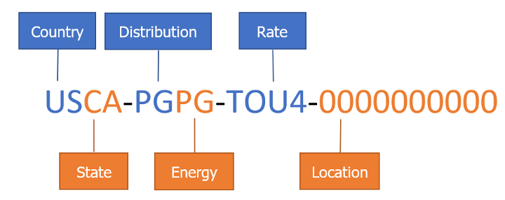

# Market Informed Demand Automation Server (MIDAS) — v2.0 Documentation

**California Energy Commission | <midas@energy.ca.gov>**

> **Release Notice — June 22, 2026**
> MIDAS v2.0 is live as of June 22, 2026. If you are migrating from v1.0, please read the [Transition Guide](Transition-Guide.md) before making any API calls. The base URL for MIDAS is **`https://midasapi.energy.ca.gov`**. All test-environment URLs referenced in pre-release materials will be deactivated July 1, 2026.

> [!NOTE]
> MIDAS 1.0 documentation is preserved here [MIDAS v1.0 Documentation](https://github.com/california-energy-commission/MIDAS/releases/tag/v1.0).

## Introduction

The California Energy Commission’s (CEC) Market Informed Demand Automation Server (MIDAS) is a database and application programming interface (API) that provides access to current, future, and historic time-varying rates, greenhouse gas (GHG) emissions associated with electrical generation, and California Flex Alert Signals. The database is populated by utilities and community choice aggregators (CCAs), WattTime’s Self-Generation Incentive Program (SGIP) marginal GHG emissions API, the California Independent System Operator (California ISO), and other entities that are registered with the MIDAS system.

MIDAS is designed to provide energy users with the electricity price information they need to optimize when they use energy. While it would be useful for electricity users to be able to use the data from MIDAS to try to estimate electricity bill totals, some billing structures such as tiered rates make this impossible without private customer-specific data. MIDAS does not, and will not, contain any private information. The only non-public data in MIDAS is login information for data uploaders.

MIDAS is accessible through a public API at <https://midasapi.energy.ca.gov> in two standard machine-readable formats: JavaScript Object Notation (JSON), and extensible markup language (XML). MIDAS is publicly accessible, allowing all registered users to query and download information by interacting with the MIDAS API. CEC strongly encourages load serving entity (LSE) users have programming skills and software to effectively upload and maintain rate information stored in the database. Registration is a simple process available through the API. Non-LSE users should be able to retrieve information stored in MIDAS without extensive programming skills. Retrieving MIDAS-hosted data can be easily done through the code examples provided or through a user’s own code. For instructions on accessing the MIDAS database, see [GET Requests — Retrieving Data](get-requests--retrieving-data) and/or [Python Examples - Appendix g](appendix-g.md).

MIDAS was developed to support the CEC's [Load Management Standards](https://www.energy.ca.gov/programs-and-topics/topics/load-flexibility/load-management-standards). The full text of the standards is available from [Westlaw](https://govt.westlaw.com/calregs/Browse/Home/California/CaliforniaCodeofRegulations?guid=ID6B950105CCE11EC9220000D3A7C4BC3).

### Who Uses MIDAS?

| User Type | What They Do |
| --------- | ------------ |
| **Read-only users** | Query rates, GHG signals, and Flex Alerts. No registration required. |
| **LSE uploaders** | Utilities, CCAs and other organizations that POST rate data. Must register, verify email, and request upload access from MIDAS team through the new access-request API endpoint. |
| **Integrators / automation providers** | Developers building load management systems, OpenADR clients, or analytics platforms on top of MIDAS data. |

**Base URL:** `https://midasapi.energy.ca.gov`

**Supported formats:** JSON and XML (XML payloads are accepted for uploads and are converted internally)

**API version:** 2.0

### Security

The MIDAS API and database are protected by the CEC firewall and data throttling to prevent Distributed Denial of Service (DDoS) attacks (see [Appendix D](appendix-d.md)). If an error occurs after an API call, the program will send a notification for CEC information technology (IT) staff to fix the issue.

## What's New in v2.0

See also: [Release Notes](release-notes.md) for the full changelog and [Transition Guide](Transition-Guide.md) for migration steps.

### For GET Users (Data Consumers)

- **No registration required** to query data. All `GET /api/valuedata` calls are now publicly accessible without a token.
- **Realtime query window:** 72 hours starting at 00:00:00 Pacific on the day of the request. The datetime values are returned in UTC.
- **Alldata query window:** 90 days ending at 23:59:59 Pacific on Day+2 of the request date. The datetime values are returned in UTC.
- **Unified SGIP GHG RINs:** 33 RINs (SGRT/SGFC/SGHT per region) consolidated into 11 MOER RINs — one per grid region.
- **Unified Flex Alert RIN:** Three RINs (FXRT/FXFC/FXHT) replaced by a single `USCA-FLEX-ALRT-0000` RIN.
- **GHG unit change:** Emissions values now reported in `g/kWh CO2` (previously `kg/kWh CO2`). Multiply old values by 1,000.
- **Updated RINList response format:** Responses are now wrapped in a top-level keyed object.
- **Removed endpoints:** `HistoricalRINList`, `Holiday`, `TimeZone` lookup table.
- **Data retention:** 2 years of active data directly accessible via API; 5 years in cold storage archive; data older than 7 years available on request at <midas@energy.ca.gov>.

### For POST Users (LSE Uploaders)

- **Re-registration required.** All existing LSE accounts must re-register and re-verify email before uploading.
- **New upload access workflow:** After registration, submit a formal request via `POST /api/uploadaccess/request`. A CEC admin will approve the request and assign authorized distribution and energy codes.
- **Multiple codes per account:** A single account may now hold multiple distribution codes and multiple energy codes.
- **Two-stage validation:** The API returns `HTTP 202 Accepted` with a `jobID` after initial validation passes. Final validation (data quality, regulatory checks) runs asynchronously. Check status at `GET /api/jobs/{jobID}`.
- **Extended token lifetime:** Tokens are now valid for 3,600 seconds.
- **Interval enforcement:** Allowed upload intervals are 1 hour, 15 minutes, and 5 minutes only. The interval is assigned to a RIN on first upload and cannot change. All units in an upload must use the same interval and the same count of data points.
- Updated documentation for uploading is available in [Appendix A](appendix-a.md).

## Database Structure

The MIDAS database supports retrieval of electric utility price schedules, California Flex Alert signals, and marginal GHG emissions from electrical generation. Flex Alerts and GHG emissions values – both forecasted and real-time - are continually retrieved from the California ISO Flex Alert site and WattTime’s SGIP API respectively. GHG realtime and forecasted values are cached, or temporarily stored, within MIDAS until new values are available while Flex Alerts are passed through MIDAS from the California ISO website, as a user queries MIDAS. A record of previously active Flex Alerts and historic GHG emissions are stored in the database.

Pursuant to the California Load Management Standards, the state’s largest utilities and CCAs are responsible for populating the MIDAS database with all time-varying rate information and values offered to customers, including the pilot rates. For upload examples, please see [Appendix A](appendix-a.md).

The primary lookup identification (ID) for the MIDAS database is a compound key comprised of six individual fields that make up a standardized rate identification number (RIN) as shown in Figure 1. RINs are assigned at the time rate information is first uploaded by the LSE through the MIDAS API. When an LSE uploads to an existing RIN, the correct RIN must be used at the time of upload. Figure 1 illustrates the six identifiers that comprise a RIN: Country, State, Distribution, Energy, Rate, and Location. The location portion of the RIN may consist of 1 to 10 characters depending on the specified location’s requirements.

Figure 1. Rate Identification Number Structure

Source: California Energy Commission

Rate Identification Numbers do not change over time. The prices and values may change, but an electricity customer's RIN should not change unless their rate components or rate modifiers change or the utility or customer changes their rate tariff.

## Rate Information

To fulfill the requirements of the California's [load management standards](https://www.energy.ca.gov/programs-and-topics/topics/load-flexibility/load-management-standards), MIDAS receives and shares information for all time-dependent rates for the three largest investor owned utilities (IOUs), the two largest publicly owned utilities (POUs) and the 14 largest CCAs in California. Time-dependent rates are rates that have prices which vary over the course of a day. Other California utilities and CCAs may use MIDAS to provide information and prices for their rates, but are not required to do so.

## SGIP GHG Emissions

MIDAS provides greenhouse gas (GHG) emissions signals for all eleven WattTime SGIP grid regions in California through region‑specific RINs following the pattern USCA‑SGIP‑MOER‑XXXX, where the final four characters identify the region. These RINs deliver 5‑minute marginal operating emissions rates sourced from the [WattTime.org SGIP API](https://sgipsignal.com), which MIDAS retrieves and stores before serving through the API. Each RIN returns a full time series in grams of CO₂ per kilowatt-hour (g/kWh CO₂) and follows the same ValueData and HistoricalData structure as all other MIDAS rate signals. For a list of the regions and region abbreviations please see WattTime’s SGIP webpage at: <https://sgipsignal.com/grid-regions>.

> [!NOTE]
> Due to GHG RIN simplification from MIDAS 1.0 to 2.0, historical GHG data prior to June 2026 was not migrated and is no longer available in MIDAS. All historical SGIP data is maintained by WattTime, who make it available in CSV format from <https://content.sgipsignal.com/download-data/>

See [Appendix F](appendix-f.md) for the full GHG emissions RIN mapping and complete list of active RINs.

## CAISO Flex Alerts

Flex Alert information is provided through a single consolidated RIN, USCA‑FLEX‑ALRT‑0000, which returns a clean and predictable hourly signal indicating whether a California ISO Flex Alert is active. MIDAS periodically polls the CAISO Flex Alert webpage and stores the results in its database, supplying users with a binary hourly value of 1 when a Flex Alert is active and 0 when no alert is in effect, with no gaps in the time series. The RIN supports both standard MIDAS query types: realtime, which provides a 72‑hour window beginning at midnight Pacific on the request date, and alldata, which provides a 90‑day window ending at 23:59:59 Pacific on Day + 2. All timestamps are returned in UTC, and the data structure aligns with the format used for other MIDAS rate signals, ensuring consistency and ease of integration.

For more information on the XML schema and uploads, see [Appendix A](appendix-a.md).

See [Appendix F](appendix-f.md) for the full FlexAlert RIN mapping and complete list of active RINs.

## Authentication

As of v2.0.0, **no authentication** is required for public GET requests to `GET /api/valuedata` with `SignalType`, `ID+QueryType`, or `LookupTable` parameters. See [Appendix A](appendix-a.md) for upload authentication requirements.

## Retrieving Data from MIDAS

### Get RIN List

Returns all RINs of a given signal type.  

| Signal Type | Description |
| ------ | -------- |
| 0 | ALL active RINs |
| 1 | All active electricity rate RINs |
| 2 | All GHG EMission RINs |
| 3 | Flex ALert RIN |

```text
GET /api/valuedata?SignalType={0|1|2|3}
```

**Response format (v2.0 — wrapped object):**

```json
{
  "Rates": [
    {
      "RateID": "USCA-BNBN-EVT2-0000",
      "SignalType": "Electricity Rates",
      "Description": "BEV-1 - CPP",
      "LastUpdated": "2026-05-22T14:56:34+0000"
    }
  ]
}
```

### Get Rate Values

```text
GET /api/valuedata?ID={RIN}&QueryType={realtime|alldata}
```

| QueryType | Window |
| ----------- | -------- |
| `realtime` | 72 hours from midnight Pacific on the request date |
| `alldata` | 90 days ending at 23:59:59 Pacific on Day+2 |

Query parameter names are **case-insensitive**. The DateStart, DateEnd, TimeStart, and TimeEnd will be returned in UTC.

Please note: If you submit a realtime query on July 1, 2026, the data window begins at 12:00:00 AM Pacific Time on that same day. However, because MIDAS returns all timestamps in UTC, the first data point will appear with a DateStart and TimeStart of 07:00:00 AM on July 1, 2026, which corresponds to midnight Pacific Time.  

**Example — Flex Alert realtime:**

```text
GET /api/valuedata?ID=USCA-FLEX-ALRT-0000&QueryType=realtime
```

**Example — GHG emissions for SMUD region:**

```text
GET /api/valuedata?ID=USCA-SGIP-MOER-SMUD&QueryType=alldata
```

### Get Historical Data

For date-range queries beyond the `alldata` 90-day window (up to 6 months per request):

```text
GET /api/historicaldata/{rate_id}?startdate=YYYY-MM-DD&enddate=YYYY-MM-DD
```

No authentication required. Maximum range: 6 months per request. Get data as old as 2 years from the date of query.

### Get Lookup Tables

```text
GET /api/valuedata?LookupTable={TableName}
```

Available tables: `Distribution`, `Energy`, `StateProvince`, `Unit`, `RateType`, `SignalType`, `DayType`. Note: `Holiday` and `TimeZone` tables have been removed in v2.0.

## Data Retention

MIDAS retains *two years* of data in the active database, available through the API. For data older than 2 years, please reach out to CEC staff at <midas@energy.ca.gov>

| Tier | Window | Access Method |
| ------ | -------- | --------------- |
| Active | 2 years | MIDAS API |
| Archive | Years 2–7 | Cold storage — contact CEC |
| Legacy | Older than 7 years | Request from CEC |

## System Health Check

These endpoints require no authentication and are intended for monitoring.

| Endpoint | Description |
| -------- | ----------- |
| `GET /health` | Basic API health check — returns `status`, `service`, `version` |
| `GET /watttime/status` | Simple up/down for WattTime token service |
| `GET /watttime/health` | Full WattTime health: token expiry, circuit breaker, cache |
| `GET /watttime/health/comprehensive` | Health score 0–100, all metrics |
| `GET /watttime/metrics` | Token refresh rates, latency, circuit breaker activations |
| `GET /caiso/status` | Simple up/down for CAISO Flex Alert service |
| `GET /caiso/health` | Full CAISO health: circuit breaker, cache, metrics |

## Error Handling

### Standard HTTP Status Codes

| Code | Meaning | Common Cause |
| ---- | ------- | ------------ |
| `200 OK` | Success | |
| `202 Accepted` | Upload received and queued | `POST /api/valuedata` |
| `400 Bad Request` | Invalid parameters or Validation Error | Bad RIN, invalid QueryType, Data Invalid |
| `401 Unauthorized` | Missing or invalid token | Token expired or not provided |
| `403 Forbidden` | Insufficient permissions | Unauthorized energy code 'MC'. User is authorized for ['PG', 'TS'] |
| `404 Not Found` | RIN not found | RIN doesn't exist in MIDAS |
| `422 Unprocessable Entity` | Validation error | Missing required fields |
| `429 Too Many Requests` | Rate Limit Error | Too high a rate of API requests |
| `503 Service Unavailable` | Upstream dependency down | WattTime or CAISO unavailable |

### Upload Validation Issue Codes

| Code | Type | Description |
| ---- | ---- | ----------- |
| `UNEQUAL_INTERVAL` | ERROR | Multiple interval lengths in one upload |
| `MISSING_INTERVAL` | WARNING | One or more time intervals absent |
| `INVALID_RIN` | ERROR | RIN not recognized or not authorized |
| `INTERVAL_MISMATCH` | ERROR | Interval differs from RIN's assigned interval |
| `DATA_GAP` | WARNING | Gap between latest MIDAS data and upload start |
| `PAST_DATA` | WARNING | Upload contains timestamps in the past |

## Rate Limits

MIDAS is protected by CEC firewall rules and request throttling. Exceeding the rate limit returns HTTP `429 Too Many Requests`. If you receive `429` errors regularly, contact <midas@energy.ca.gov> to discuss your use case.

## External Resources

The following external resources are provided as optional references for users.
These resources are created and maintained by third parties, and the California Energy Commission has no control over the content, accuracy, or availability of these sites. Inclusion of these links does not constitute endorsement.

- [Interactive MIDAS Web tool](https://midasinterface.com/)
- [Python Client Library for MIDAS](https://github.com/grid-coordination/python-midas)
- [MIDAS API Specs](https://github.com/grid-coordination/midas-api-specs)

## Appendices

### Appendix A Uploading to MIDAS

[Appendix A](appendix-a.md) discusses rate upload and contains links to example upload documents.

### Appendix B Acronyms and Glossary

[Appendix B](appendix-b.md) contains a list of acronyms and a glossary.

### Appendix C Lookup Tables

[Appendix C](appendix-c.md) contains a list of all lookup tables available through MIDAS.

### Appendix D MIDAS Architecture

[Appendix D](appendix-d.md) contains a diagram of the MIDAS API service architecture.

### Appendix E MIDAS Data Dictionary

[Appendix E](appendix-e.md) contains the description of the data dictionary and a link to download it.

### Appendix F SGIP and FlexAlert in MIDAS

[Appendix F](appendix-f.md) contains detailed information about WattTime's SGIP and CAISO's FlexAlert data in MIDAS

### Appendix G Python Code Examples

[Appendix G](appendix-g.md) contains example code in MIDAS to upload and access MIDAS data
